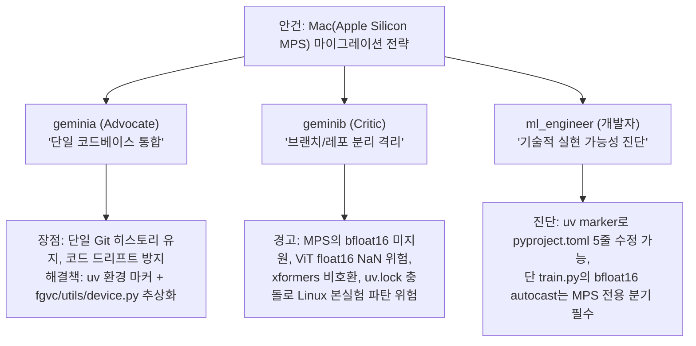

# 토론 기록: Mac(Apple Silicon MPS) 마이그레이션 전략 회의

- **일시**: 2026-09-16
- **주제**: CUDA 12.4 전용 FGVC-DINOv3 프로젝트의 Mac 마이그레이션 최적 방식 도출
- **참여자**:
  - 팀 리더 (Antigravity): 회의 주재 및 종합
  - `geminia` (The Advocate): 단일 코드베이스 크로스 플랫폼 통합 옹호
  - `geminib` (The Critic): 리스크 분석 및 브랜치/레포 격리 분리 주장
  - `ml_engineer` (ML Pipeline Engineer): 실무 엔지니어링 및 구현 난이도 진단

---

## 1. 에이전트별 핵심 의견 요약

---

## 2. 상세 발언록 (Debate Transcript)

### 2.1 `geminia` (The Advocate) 발언 전문
> **"단일 코드베이스(SSOT) 유지 및 크로스 플랫폼 추상화 전략"**
> 
> 1. **단일 코드베이스의 압도적 우위**: 레포지토리를 분리할 경우 단기적으로는 쉬워 보이지만, 본 프로젝트처럼 전처리, 모델(DINOv3 LoRA), HPO, 추론 파이프라인이 밀접한 연구 환경에서는 **기능 동기화 누락과 코드 드리프트**가 필연적으로 발생합니다. 단일 Git 히스토리를 유지해야 실험 재현성을 보장하고 CI/CD 매트릭스를 통합할 수 있습니다.
> 2. **`uv` 플랫폼 마커를 통한 패키징 해결**: `pyproject.toml`의 `tool.uv.sources`에 PEP 508 환경 마커(`marker = "sys_platform == 'linux'"`)를 적용하면, Linux에서는 CUDA 인덱스를, macOS에서는 공식 PyPI MPS 빌드 휠을 단일 `uv.lock`에서 자동 분기하여 설치할 수 있습니다.
> 3. **디바이스 런타임 자동 감지**: `fgvc/utils/device.py`에 `get_device()`(우선순위: 환경변수 `FGVC_DEVICE` → CUDA → MPS → CPU)와 캐시 정리 다형성을 캡슐화하면 비즈니스 로직 수정을 최소화하고 완벽한 이식성을 달성할 수 있습니다.

---

### 2.2 `geminib` (The Critic / Skeptic) 발언 전문
> **"단일 레포 통합은 Linux 본 실험 환경을 파괴하는 오버엔지니어링입니다. 격리 분리해야 합니다."**
> 
> 1. **`uv.lock` 분기 파탄 리스크**: macOS ARM64에는 `cu124` 휠이 없습니다. Mac 개발자가 로컬에서 `uv lock`을 치는 순간 Linux CUDA용으로 잠겨 있던 `uv.lock`이 뒤틀려 Git 충돌이 발생하고 Linux 서버의 배치 스크립트가 중단됩니다.
> 2. **DINOv3 백본의 하드웨어 의존성**: Meta DINOv3는 `xformers`나 `flash-attn` 같은 CUDA 전용 연산자를 요구합니다. Mac MPS에서는 컴파일조차 되지 않으므로 로컬 `dinov3` 디렉토리 내부 코드까지 건드려 SDPA fallback 몽키패치를 쳐야 하는 코드 오염이 발생합니다.
> 3. **MPS의 `bfloat16` 고질적 결함**: `train.py`의 `torch.autocast(dtype=torch.bfloat16)`는 MPS에서 연산자 미지원(`NotImplementedError`)으로 즉시 크래시 납니다. float16으로 바꾸면 ViT 어텐션 특성상 Underflow/NaN Loss로 발산합니다. 결국 수많은 `if device.type == 'mps'` 분기 코드가 바이러스처럼 번집니다.
> 4. **권고안**: 
>    - 1순위: **Remote-SSH 개발** (Mac은 클라이언트로만 쓰고 연산은 Linux GPU 서버에서 수행. 마이그레이션 비용 0원)
>    - 2순위: Mac 로컬 실행이 필수라면 **Git 브랜치 격리 (`feature/mac-mps`)** 또는 **레포 듀플리케이트**를 통해 Linux 메인 환경의 무결성을 100% 보존해야 함.

---

### 2.3 `ml_engineer` (ML Pipeline Engineer) 진단 전문
> **"엔지니어링 실무 진단 및 기술적 타당성 분석"**
> 
> 1. **`pyproject.toml` 마커 분기 가능**: `tool.uv.sources` 내 `marker = "sys_platform == 'linux'"`와 `tool.uv.environments = ["sys_platform == 'linux'", "sys_platform == 'darwin'"]`를 설정하면 단일 설정 파일 관리가 기술적으로 가능합니다.
> 2. **치명적 위험 포인트 확인 (`autocast`)**: 코드베이스 진단 결과, `pipeline.py`의 디바이스 폴백 누락뿐 아니라 `fgvc/engine/train.py`의 `bfloat16 autocast`가 MPS에서 가장 큰 장애물입니다. 디바이스별로 CUDA는 `bfloat16`, MPS는 `float16` 또는 FP32 disable을 선택 반환하는 `get_autocast_context(device)` 추상화가 반드시 수반되어야 합니다.
> 3. **공수 판단**: 단일 레포 통합은 파일 1개 신설, 호출부 3~4곳 수정으로 0.5MD(반나절) 수준이나, geminib이 지적한 MPS 런타임 예외 처리를 사전에 꼼꼼히 가드레일로 막아야 합니다.

---

## 3. 핵심 쟁점 및 비교 매트릭스

| 쟁점 | 옵션 1: Git 브랜치 분리 (`feature/mac-mps`) | 옵션 2: 단일 레포 통합 (`uv` 마커 + 추상화) | 옵션 3: 레포 듀플리케이트 |
| :--- | :--- | :--- | :--- |
| **Linux 환경 안전성** | 🟢 **최고** (메인 브랜치 오염 0%) | 🟡 **주의** (가드레일 및 세심한 테스트 필요) | 🟢 **최고** (물리적 분리) |
| **코드 동기화 편의성** | 🟢 **우수** (`git cherry-pick`/`rebase`) | 🟢 **최고** (단일 커밋으로 양쪽 반영) | 🔴 **불편** (수동 패치 복사) |
| **DINOv3/MPS 호환성** | 🟢 브랜치 내에서 과감한 Mac 전용 수정 가능 | 🟡 조건 분기 레이어로 감싸야 함 | 🟢 Mac 전용 커스텀 코드 유지 가능 |
| **적용 권장 시나리오** | Mac에서 개발/디버깅 후 Linux에 배포하는 경우 | 팀 전체가 단일 레포를 안정적으로 공유하길 원할 때 | 완전히 독립된 맥 전용 앱으로 갈라질 때 |
